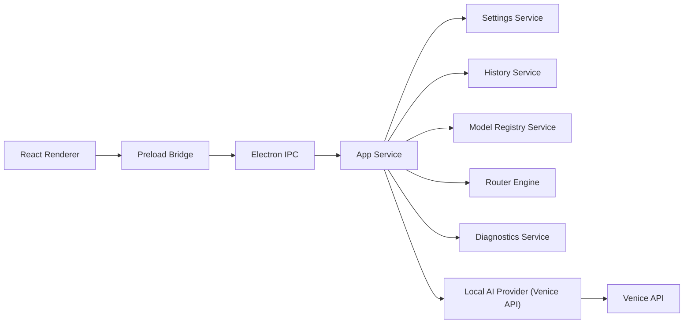

# Local AI

Local AI is a production-style desktop AI chat and coding application built for macOS, Windows, and Linux from one Electron + React + TypeScript codebase. It is designed to feel minimal, premium, keyboard-friendly, and fast, with capability-first routing, streaming responses, local history, diagnostics, and a safe reasoning-summary panel that does not expose hidden chain-of-thought.

## What the app does

- Provides a focused desktop chat and coding workspace with conversation history, settings, diagnostics, and capability routing.
- Uses Venice as the underlying model provider while presenting the product to users as `Local AI`.
- Dynamically discovers available Local AI text, image, and video models from the Venice API.
- Classifies each request into capability lanes such as `Uncensored`, `Write`, `Research`, `Learn`, `Build`, `Image`, and `Video`.
- Automatically selects the best internal model per request based on complexity, latency, creativity, tone-fidelity needs, safety posture, and fallback policy.
- Streams text responses in real time and renders image/video outputs inline.

## Why Electron was chosen

This implementation uses Electron instead of Tauri.

Reasoning:

- The repository already had a working Electron/Vite desktop foundation, which reduced migration friction and kept effort focused on product quality instead of shell replacement.
- Electron provides a mature cross-platform desktop runtime for streaming IPC, window management, packaging, preload isolation, and incremental app hardening.
- For this version, Electron made it faster to ship a coherent production-style architecture with real Venice integration, local persistence, secure desktop settings handling, and packaging scripts for macOS, Windows, and Linux.

Tauri remains a viable future migration path, but Electron was the lower-risk choice for this codebase and delivery scope.

## Architecture



Core modules:

- `src/main/services/local-ai-provider.ts`: provider abstraction around Venice endpoints, streaming chat, image generation, and video generation.
- `src/main/services/model-registry-service.ts`: model discovery, cache refresh, normalization, and internal metadata enrichment.
- `src/main/services/router-engine.ts`: request classification, capability-lane assignment, creative freedom heuristics, and model selection.
- `src/main/services/app-service.ts`: orchestration layer joining routing, provider execution, history persistence, diagnostics, and stream events.
- `src/renderer/src/stores/app-store.ts`: renderer state, stream handling, optimistic UI updates, and view coordination.

## Venice integration

Although the UI calls the provider `Local AI`, the current backend provider implementation uses the Venice API:

- Base URL: `https://api.venice.ai/api/v1`
- Model discovery: `/models` and `/models/traits`
- Streaming chat: `/chat/completions`
- Image generation: `/image/generate`
- Video generation: `/video/queue` and `/video/retrieve`

The provider layer is intentionally modular so future providers can be added later without rewriting the renderer or router.

## How model routing works

The router evaluates every request across multiple dimensions:

- task type
- complexity
- urgency
- required context
- sensitivity score
- creativity score
- precision score
- freedom score
- lane hint from the UI

User-facing routing lanes:

- `Uncensored`
- `Write`
- `Research`
- `Learn`
- `Build`
- `Image`
- `Video`

The UI does not expose raw model names. Instead, the router assigns the best internal model automatically.

Routing behavior examples:

- `Build` requests prefer coding/reasoning models and longer context when complexity is high.
- `Research` and `Learn` prefer reasoning models and web-search-capable candidates when available.
- `Uncensored` prefers the most expressive benign-safe path when creative freedom is enabled.
- `Image` routes to the strongest image model currently available.
- `Video` routes to prompt-compatible text-to-video models.

Fallback chains are generated per request so the app can recover gracefully if a primary model fails.

## How less-restrictive routing works

Local AI uses a soft preference system for benign creative freedom:

- When a request is lawful and benign but strongly signals directness, raw tone, gritty dialogue, dark fiction, taboo-topic fiction, or explicit tone fidelity, the router can prefer a less-restrictive model.
- This only happens when user settings allow it.
- Users can further tune routing with:
  - `Creative Freedom Mode`
  - `Tone Protection`
  - `Enable less-restrictive routing`
  - `Never auto-route to less-restrictive`
  - `Ask before model-class switches`
  - `Prefer tone fidelity over sanitization`

## Creative freedom system

The app is designed to be permissive by default for lawful benign content.

Key design choices:

- fewer false positives
- tone fidelity preserved when safe
- adult-oriented creative latitude for fiction, dialogue, satire, horror, intense tone, edgy writing, and controversial but lawful content
- less-restrictive routing only when it improves harmless user intent

The router calculates a `freedomScore` and combines it with:

- prompt content
- lane selection
- creative freedom settings
- tone protection settings
- hard policy checks

## Safe reasoning summaries vs hidden chain-of-thought

The app explicitly does **not** expose hidden chain-of-thought.

Important implementation detail:

- Venice can emit `reasoning_content` during streaming on some reasoning models.
- The provider strips hidden reasoning from the visible stream by using Venice’s model feature suffix support.
- The UI shows only:
  - routing reasons
  - phase transitions
  - progress states
  - safe reasoning summaries generated by app logic

Examples shown to the user:

- `Analyzing request`
- `Selecting model`
- `Streaming response`
- `Refining output`
- `High-complexity build task detected`
- `Benign high-expression request routed for tone fidelity`

## Two-layer moderation design

The app uses a two-layer moderation strategy:

1. Soft policy layer

- tuned to preserve benign creative freedom
- tries to avoid false positives
- influences routing rather than blocking whenever possible

2. Hard policy layer

- blocks only clearly dangerous or clearly illegal content
- intended for high-confidence boundary cases such as extreme violent wrongdoing or child sexual abuse content

This is implemented in the router/orchestration layer so benign creative work remains low-friction.

## Project structure

- `src/main`: Electron main-process code and services
- `src/preload`: secure renderer bridge
- `src/shared`: shared app/domain types and defaults
- `src/renderer/src/components`: renderer UI modules
- `src/renderer/src/stores`: Zustand application state
- `src/renderer/src/styles`: Tailwind/global styling

## Development

### Prerequisites

- Node.js 20+
- npm 10+ or compatible

### Install

```bash
npm install
```

### Run in development mode

```bash
npm run dev
```

### Typecheck

```bash
npm run typecheck
```

### Run tests

```bash
npm test
```

## Build and package

### Production build

```bash
npm run build
```

### macOS package

```bash
npm run dist:mac
```

### Windows package

```bash
npm run dist:win
```

### Linux package

```bash
npm run dist:linux
```

## Environment variables

Provide your API key through the environment or the in-app Settings UI. No key is bundled in the source.

- `LOCAL_AI_API_KEY`
- `VENICE_API_KEY`

Copy `.env.example` to `.env` and fill in your own key. See [.env.example](./.env.example).

## Settings included

- Local AI API key management
- automatic routing
- routing priority mode
- streaming toggle
- animations toggle
- compact mode toggle
- show/hide inspector
- verbose diagnostics
- creative freedom mode
- tone protection
- less-restrictive routing policy
- clear history

## Testing

Current test coverage includes:

- router unit tests
- provider registry normalization test

## Notes

- The UI intentionally hides raw model selection from end users and uses capability lanes instead.
- Internal routing still tracks exact selected/fallback models for diagnostics and future provider expansion.
- The app currently packages unsigned on macOS in this environment. For real distribution, add platform signing/notarization credentials.

## Author

Built by [Jayadev Rana](https://jayadevrana.in) — @bluealgocapital · [YouTube](https://www.youtube.com/@jayadevrana3657) · [GitHub](https://github.com/jayadevrana)
